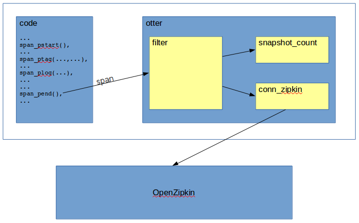

# OTTER

OpenTracing Toolkit for ERlang

## Build

OTTER uses [rebar3](http://www.rebar3.org) as build tool. It can be built
with:

```
    rebar3 compile
```

However most likely you'll want to add it to your project in your build
environment.

## Dependencies

[ibrowse](https://github.com/cmullaparthi/ibrowse) HTTP client is used
to send the HTTP/Thrift requests to Zipkin. There are no other dependencies
 required.

## OpenTracing

[OpenTracing](http://opentracing.io) is an open initiative to provide a
set of terms and methods to produce, collect and correlate trace
information in a distributed environment across different programming
languages, platforms and protocols.

The concept defined for trace production is based on a **span** which is
essentially a record of a handling in one environment. A **span** has a
**timestamp** of when it started, a **duration**, a list of timestamped
events marking the timing important actions during the **span** and a
list of key-value tags storing the parameters of the handled request
(e.g. customer ids, transaction ids, results of subsequent actions).
The **span** also contains id's to aid their correlation. The
**trace_id** is used for correlating **span**s related to the handling
of one request received from different systems. The **trace_id** is
generated in the first system which starts handling a request (e.g. a
frontend) and supposed to be passed on to other systems involved in the
processing the same request. This is fairly simple when the protocols
are fully under control and extensible (which is very often not the case).
Other id's recorded are the **span_id** and a **parent_id** referring to
the parent **span** that help showing a hierarchical relationship of
the **span**s in the **trace collector**.

After collecting this information, the **span** can be sent to a trace
collector which then based on the id's of the received spans can
correlate them and provide and end-to-end record of the request.
sending all produced **span**s could generate significant additional
load on the system producing them and also on the **trace collector**.
It is recommended to filter the the **span**s before sending them to the
collector.

The most mature **trace collector** at the time of the initial development
 is [OpenZipkin](http://zipkin.io). OTTER provides an interface to send
spans to Zipkin using the HTTP/Thrift.

The OpenTracing terminology defines information to be passed on across
systems. The feasibility of this in most cases depends on the protocols
used, and usually rather difficult to achieve. OTTER is not attempting to
implement any of this functionality. It is possible though to initialize
a **span** in OTTER with a **trace_id** and **parent_id**, but how these
id's are passed across the systems is left to the particular implementation.

## OTTER functionality

OTTER helps producing span information, filtering spans, sending to
trace collector (Zipkin), counting and keeping a snapshot of the last
occurrence of a span.





### Producing span information

The main motivation behind the span collection of Otter is to make the
instrumentation of existing code as simple as possible.

#### Types used in the API

The following type specifications are in otter.hrl

```erlang
-type time_us() :: integer().           % timestamp in microseconds
-type info() :: binary() | list() | integer() | atom().
-type trace_id() :: integer().
-type span_id() :: integer().

-record(span , {
    timestamp   :: time_us(),           % timestamp of starting the span
    trace_id    :: trace_id(),          % 64 bit integer trace id
    name        :: info(),              % name of the span
    id          :: span_id(),           % 64 bit integer span id
    parent_id   :: span_id() | undefined, % 64 bit integer parent span id
    tags = []   :: [{info(), info()}],  % span tags
    logs = []   :: [{time_us(), info()}], % span logs
    duration    :: time_us()            % microseconds between span start/end
}).

-type span()    :: #span{}.

```

#### Functional API

Passing the span structure between requests, this API will probably
require to pass the span in function calls if the function has
something to add to the span. This requires more code changes, however
when functions pass non-strict composite structures (e.g. maps or
proplists) then inserting the span information is more or less trivial.

Start span with name only. Name should refer e.g. to the interface.
```erlang
-spec span_start(info()) -> span().
```

Start span with name and trace_id where trace_id e.g. received from
protocol.

```erlang
-spec span_start(info(), integer()) -> span().
```

Start span with name, trace_id and parent span id e.g. received from
protocol.

```erlang
-spec span_start(info(), integer(), integer()) -> span().
```

Add a tag to the previously started span.
```erlang
-spec span_tag(span(), info(), info()) -> span().
```

Add a log/event to the previously started span erlang
```erlang
-spec span_log(span(), info()) -> span().
```

End span and invoke the span filter (see below)
```erlang
-spec span_end(span()) -> ok.
```

Get span id's. Return the **trace_id** and the **span** id from the
currently started span. This can be used e.g. when process "boundary" is
to be passed and eventually new span needs this information. Also when
these id's should be passed to a protocol interface for another system
```erlang
-spec span_ids(span()) -> {trace_id(), span_id()}.
```
example :

```erlang
    ...
    Span = otter:span_start("radius request"),
    ...
    ...
    Span1 = otter:span_tag(Span, "request_id", RequestId),
    ...
    ...
    Span2 = otter:span_plog(Span1, "invoke user db"),
    ...
    ...
    Span3 = otter:span_plog(Span2, "user db result"),
    Span4 = otter:span_ptag(Span3, "user db result", "ok"),
    ...
    ...
    Span5 = otter:span_ptag(Span4, "final result", "error"),
    Span6 = otter:span_ptag(Span5, "final result reason", "unknown user"),
    otter:span_pend(Span6),
    ...
```

#### Process API

The simplest API uses the process dictionary to store span information.
This is probably the least work to implement in existing code.

Start span with name only. Name should refer e.g. to the interface.

```erlang
-spec span_pstart(info()) -> ok.
```

Start span with name and trace_id where trace_id e.g. received from
protocol.

```erlang
-spec span_pstart(info(), trace_id()) -> ok.
```

Start span with name, trace_id and parent span id e.g. received from
protocol.

```erlang
-spec span_pstart(info(), trace_id(), span_id()) -> ok.
```

Add a tag to the previously started span.

```erlang
-spec span_ptag(info(), info()) -> ok.
```

Add a log/event to the previously started span
```erlang
-spec span_plog(info()) -> ok.
```

End span and invoke the span filter (see below)
```erlang
-spec span_pend() -> ok.
```

Get span id's. Return the **trace_id** and the **span** id from the
currently started span. This can be used e.g. when process "boundary" is
to be passed and eventually new span needs this information. Also when
these id's should be passed to a protocol interface for another system

```erlang
-spec span_pids() -> {trace_id(), span_id()}.
```

Return the current span. e.g. it can be handed to another process to
continue collecting span information using the functional API.

```
-spec span_pget() -> span().
```

example :

```erlang
    ...
    otter:span_pstart("radius request"),
    ...
    ...
    otter:span_ptag("request_id", RequestId),
    ...
    ...
    otter:span_plog("invoke user db"),
    ...
    ...
    otter:span_plog("user db result"),
    otter:span_ptag("user_db_result", "ok"),
    ...
    ...
    otter:span_ptag("final_result", "error"),
    otter:span_ptag("final_result_reason", "unknown user"),
    otter:span_pend(),
    ...
```

A note on the tag key/value and log types: the Zipkin interface requires
string types. The Zipkin connector module (otter_conn_zipkin.erl) attempts
to convert: integer, atom, list types to binary. This allows using these
data types too as keys, values and logs, however any other "non-obvious"
types would still need conversion (or simply can not be used). The impact
of having an incompatible type in the tag keys, values and logs will likely
crash the encoding/sending function in the Zipkin connector module resulting
in the loss in the particular batch of spans.

#### Configuration

There is no configuration involved in the stage of producing span data

### Span Filtering

When the collection of **span** information is completed (i.e. span_pend
or span_end/1 is called), filtering is invoked. Filtering is based on the
tags collected in the span with the **span name** and the
**span duration** added to the key/value pair list with keys :
**"otter_span_name"** and **"otter_span_duration"**. The resulting
key/value pair list which is used as input of the filter rules. With the
 examples above it can look like this :

```erlang
    [
        {"otter_span_name", "radius request"},
        {"otter_span_duration", 1202},
        {"request_id", "6390266399200312"},
        {"user_db_result", "ok"},
        {"final_result", "error"},
        {"final_result_reason", "unknown user"}
    ]
```

This key/value pair list is passed to a sequence of conditions/actions
pairs. In each pair the, conditions are a list of checks against the
key/value pair list. If all conditions in the list are true, the actions
are executed. An empty condition list always returns a positive match.

#### Filter conditions

##### Check the presence of a Key


```erlang
    {present, Key}
```

##### Check whether 2 Keys have the same value

```erlang
    {same, Key1, Key2}
```

##### Compare a value

The value of a Key/Value pair can be compared to a value

```erlang
    {value, Key, ValueToCompare}
```

example: check the name of the span

```erlang
    {value, "otter_span_name", "radius request"}
```

##### Checking integer values

Key/Value pairs with integer values can be checked with the following
conditions.

```erlang
    {greater, Key, Integer}

    {less, Key, Integer}

    {between, Key, Integer1, Integer2}
```

example: check whether the span duration is greater than 5 seconds

```erlang
    {greater, "otter_span_duration", 5000000}
``

##### Negate condition check

```erlang
    {negate, Condition}
```

example: Check if the final result is other than ok

```erlang
    {negate, {value, "final_result", "ok"}}
```

#### Filter Actions

##### Snap/Count

Snap/Count increases a counter with a key composed by a fixed prefix and
values of Key/Values in the Key/Value list. The key is a list of parameters.
Also it stores the last **span** that triggers the counter in an ets
table. These cheap snapshots can be used for initial analysis of eventual
problems. The snapshots and counter can be retrieved by the otter counter
API (see below).

```erlang
    {snap_count, Prefix, KeyList}
```

example: snap/count any request that take long in different counters for
each span name and final result. The condition example above with the
otter_span_duration could be used to trigger this action.

```erlang
    {snap_count, [long_request], ["otter_span_name", "final_result"]}
```

This will produce a counter and snapshot with e.g. such key :

```erlang
    [long_request, "radius request", "ok"]
```

##### Send span to Zipkin

This action triggers sending the span to Zipkin

```erlang
    send_to_zipkin
```

##### Stop evaluating further Condition/Action pairs

Normally each span triggers checking of all Condition/Action pairs in the
sequence (executing all relevant actions). However if for a particular set
of conditions it is not necessary, the break action can be used. When
this is found in an Action list then all actions in the current list are
executed and no further Condition/Action pairs are checked.

```erlang
    break
```

#### Filter configuration

The filter rules are configured under **filter_rules**

#### Example

example Condition/Action (rule) list:

```erlang
    [
        {
            %% Condition
            [
                {greater, "otter_span_duration", 5000000},
                {value, "otter_span_name", "radius request"}
            ],
            %% Action
            [
                {snap_count, [long_radius_request], []},
                send_to_zipkin
            ]
        },
        {
            %% Condition counts all requests with name and result
            [
            ],
            %% Action
            [
                {snap_count, [request], ["otter_span_name", "final_result"]}
            ]
        }

    ]
```

### Sending a span to Zipkin

As a result of filter action **send_to_zipkin** the span is forwarded to
the trace collector using HTTP/Thrift binary protocol. In the context of
the span producing process the span is added to a buffer (ETS table). The
content of this buffer is sent to Zipkin asynchronously in intervals
configured in **zipkin_batch_interval_ms** (milliseconds).

The URI of the Zipkin trace collector is configured in **zipkin_collector_uri**.

Zipkin requires a node entry for every single tag collected in the span.
This entry contains the service name and IP/Port of the node sending the
span. This information is added to the tags by the Zipkin connector module
(otter_conn_zipkin.erl) during encoding the span. The values used for this
are provided in **zipkin_tag_host_service**, **zipkin_tag_host_ip** and
**zipkin_tag_host_port** configuration parameters.

Note : The otter_conn_zipkin.erl module implements Thrift binary decoding
of Zipkin span information as well. Using it with e.g. a cowboy handler
can be a base for own trace correlator/collector/proxy implementations.
This is considered as a possible development eventually.

Sending the span to Zipkin utilizes the [ibrowse](https://github.com/cmullaparthi/ibrowse)
http client (which is the only dependency of OTTER).


### Snapshot/Counter

As a result of the filter snap_count action, 2 ETS tables are used to
count events (see snap_count action above) and in the same time store
the last span information that has increased the counter. This can be
considered a useful and fairly cheap troubleshooting tool.

Tho retrieve and manage these snapshot counters, OTTER provides API calls
 in the otter API module.

##### List counters

```erlang
    -spec counter_list() -> [{list(), integer()}].
```

example:

```erlang
3> otter:counter_list().
[{[long_span,test_request],1},
 {[otter_conn_zipkin,send_spans,failed],1},
 {[span_processed,"customer db lookup"],1},
 {[span_processed,test_request],1},
 {[long_span,"customer db lookup"],1}]
```

##### Retrieve snapshot for counter

```erlang
    -spec counter_snap(list()) -> term().
```

example:

```erlang
4> otter:counter_snap([long_span,test_request]).
[{[long_span,test_request],
  [{snap_timestamp,{2017,2,21,19,8,23,76525}},
   {data,{span,1487700503067982,3826404163842487863,
               test_request,1113017739039451686,undefined,
               [{customer_id,1},
                {transaction_id,3232323},
                {magic_tag,"wizz"},
                {magic_result,error},
                {db_result,"bad customer"},
                {final_result,error}],
               [{1487700503067998,"starting some magic"},
                {1487700503068000,"finished magic"},
                {1487700503068012,"db lookup"},
                {1487700503076491,"db lookup returned"}],
               8525}}]}]
```

##### Delete counter (and its snapshot)

```erlang
    -spec counter_delete(list()) -> ok.
```

##### Delete all counters and snapshots

```erlang
    -spec counter_delete_all() -> ok.
```

## OTTER Configuration

The OTTER application configuration is handled through the otter_config
module (otter_config.erl). In the default implementation it uses the
application environment. An example configuration can be found in the
otter.app.src file.

```erlang
  ...
  [
    {zipkin_collector_uri, "http://172.17.0.2:9411/api/v1/spans"},
    {zipkin_batch_interval_ms, 100},
    {zipkin_tag_host_ip, {127,0,0,1}},
    {zipkin_tag_host_port, 0},
    {zipkin_tag_host_service, "otter_test"},
    {filter_rules, [
        {
            [
                {greater, "otter_span_duration", 1000}
            ],
            [
                {snap_count, [long_span], ["otter_span_name"]}
            ]
        },
        {
            [],
            [
                {snap_count, [span_processed], ["otter_span_name"]},
                send_to_zipkin
            ]
        }
    ]}
  ],
  ...
```

